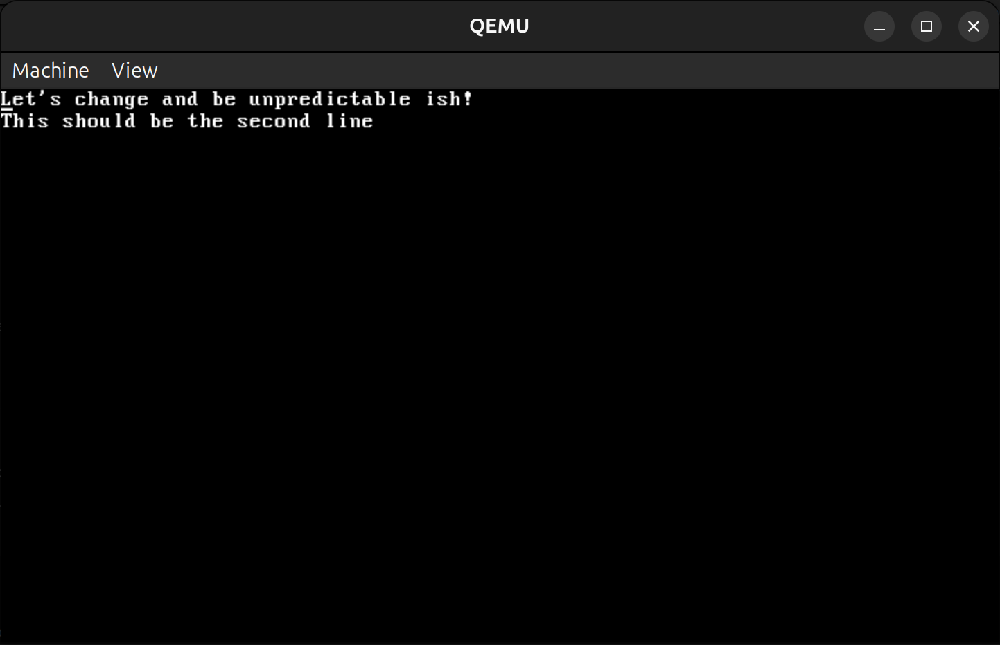

# FLOW OS 🌊

> *Fast, Light, Optimized, Windlike*

An x86 operating system built from scratch for learning OS internals. Designed for QEMU emulation, this personal project represents a development journey into low-level system operations.

**⚠️ Educational Project:** Not production-grade—just a learning stepping stone to OS development.

---

## 🎯 Project Goals

### Core Philosophy
- 🚀 Fast, smooth, and lightweight experience
- 🔧 Easy installation process
- 🖥️ High hardware compatibility
- 📦 Robust driver support
- 🌍 Open-source distribution

### Technical Milestones

| Area | Minimum Feature | Why It Matters |
|------|-----------------|----------------|
| **Boot + Memory** | Bootloader loads kernel, paging enabled | Memory management & segmentation |
| **Tasking** | Basic scheduler (round-robin or priority) | Concurrency primitives |
| **Interrupts** | Handle timer + keyboard interrupts | CPU state control |
| **File/IO System** | Read/write simple FS (FAT12 or custom) | Block device I/O knowledge |
| **Syscalls** | System calls for user programs | Kernel ↔ user mode interaction |
| **Documentation** | README + architecture notes | Technical communication |

---

## 🔨 Current Development Focus

The project is being rewritten with **GRUB bootloader** for improved boot protocol compliance and easier development.

---

## ⚡ Quick Start

### Prerequisites
- QEMU emulator
- GCC cross-compiler (x86 target)
- GNU Make
- GRUB tools (`grub-mkrescue`, `grub-file`)

### Installation & Build

```bash
# 1. Clone the repository
git clone git@github.com:tuanminh25/os.git
cd os

# 2. Build and run
./command.sh
# or use the detailed build script
./run-os.sh
```

### Build Scripts

| Script | Purpose |
|--------|---------|
| `./command.sh` | Quick build and run (recommended for most use) |
| `./run-os.sh` | Detailed build with step-by-step verification |
| `./clean.sh` | Clean all build artifacts and temporary files |

### Common Commands

```bash
# Clean build artifacts
./clean.sh

# Build and run OS
./run-os.sh

# Clean and rebuild
./clean.sh && ./run-os.sh
```

---

## 📸 Current State

**GRUB Bootloader View:**


**FLOW OS Running:**



---

## 🛠️ Planned Features

- **Memory Allocation Simulator** - For visualizing and debugging memory management once that phase is reached

---

## 🤝 Contributions & Acknowledgments

This project serves as an **educational resource** for others learning OS development.

**Special thanks to [NANOBYTE](https://www.youtube.com/@nanobyte-dev)** for providing the inspiration and tutorials that made this project possible.

---

## 📚 Documentation

Check out the `/notes` directory for detailed documentation on:
- Architecture decisions
- Boot process
- Memory management
- Kernel development
- Assembly and build tools

---

<div align="center">

**~ Learning and exploring ~**

</div>
