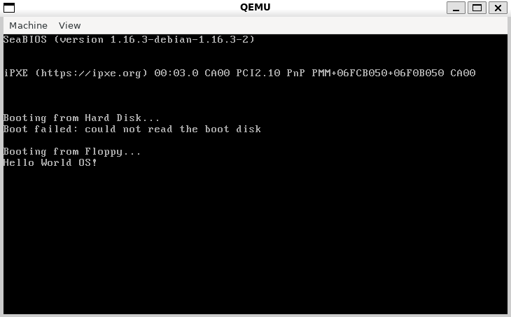

# FLOW OS

This is an operating system project targeting the x86 architecture, designed to run in the QEMU emulator.

This personal project represents both my development work and learning journey in OS internals. I'm building it from scratch to gain deep understanding of low-level system operations.

## Current Development Focus

I'm currently working on two parallel tracks:

1. **FAT12 Filesystem Implementation** - Learning and implementing disk operations for this simple filesystem format, which serves as a foundation for storage management.

2. **Memory Allocation Simulator Tool** - Developing a testing environment that simulates various memory allocation strategies (first-fit, best-fit, worst-fit). This tool will:
   - Visualize memory allocation in real-time
   - Help me understand fragmentation issues
   - Provide a testbed for optimization before implementing in the actual OS
   - Serve as a critical component when advanced memory management is integrated

## Contributions

This project can serve as an educational resource for others learning OS development.

Thanks to NANOBYTE for providing the inspiration and tutorials that made this project possible.